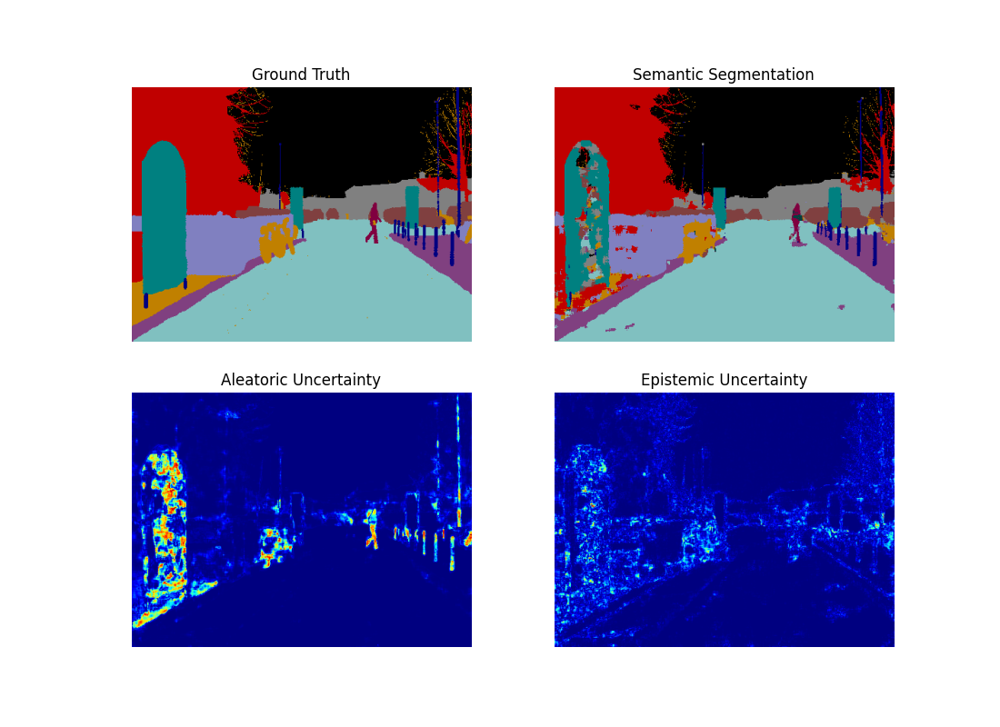

# BNN semantic segmentation based on work What Uncertainties Do We Need in Bayesian Deep Learning for Computer Vision?

Pytorch implementation of ["What Uncertainties Do We Need in Bayesian Deep Learning for Computer Vision?", NIPS 2017](https://arxiv.org/abs/1703.04977) 
This work use the [repo](https://github.com/hmi88/what) as main skeleton but change the task from regression to semantic segmentation as the paper shows.
You can learn more details by reading a nice [blog](https://github.com/kyle-dorman/bayesian-neural-network-blogpost).

## Some results
### Result of CamVid dataset
Input 
  
Results
 


### Result of AMZ dataset 
(for ETH racing team AMZ, note that this is not public)
Here we show the result from epoch 0 - 20 - 40 - 60 -80. You can see how the results change.

 Input 
 
Label
 
Prediction
 
Aleatoric Uncertainty

Epistemic Uncertainty


As you can see above the aleatoric is high around the cone boundary. This make sense because
the boundary part is related to the measurement precision.

As for Epistemic uncertainty you can see it is larger where cone is far away. This indicates
that we have more uncertainty in large range and need more data for that.


## 1. Download the dataset
You can download the CamVid dataset by looking at this [repo]](https://github.com/alexgkendall/SegNet-Tutorial).
You can also make your own dataset class easily follow the template.


## 1. Usage

```
# Data Tree
config.data_dir/
└── config.data_name/

# Project Tree
WHAT
├── BNN_seg_src/
│       ├── data/ *.py
│       ├── loss/ *.py
│       ├── model/ *.py
│       └── *.py
└── BNN_seg_exp/
         ├── log/
         ├── model/
         └── save/         
```


### 1.1  Train

```
# Classification loss only 
python main.py --uncertainty "normal" 

# Epistemic / Aleatoric 
python main.py --uncertainty ["epistemic", "aleatoric"] 

# Epistemic + Aleatoric
python main.py --uncertainty "combined" 
```


### 1.2 Test

```
# Classification loss only 
python main.py --is_train false --uncertainty "normal" --exp_load "the name of experiment siffix"

# Epistemic
python main.py --is_train false --uncertainty "epistemic" --n_samples 25 [or 5, 50] --exp_load "the name of experiment siffix"

# Aleatoric
python main.py --is_train false --uncertainty "aleatoric"  --exp_load "the name of experiment siffix"

# Epistemic + Aleatoric
python main.py --is_train false --uncertainty "combined" --n_samples 25 [or 5, 50] --exp_load "the name of experiment siffix"
```
Note that if your model name is "combined_1027_1450" then for exp_load you should use 1027_1450


### 1.3 Requirements

- Python3.7

- Pytorch >= 1.0
- Torchvision
- distutils


## 2. Experiment

This is not official implementation.


### 2.1 Network 

- Autoencoder based on [Bayesian Segnet](https://arxiv.org/abs/1511.02680)

  - Network depth 3 
  - Drop_rate 0.5 


### 2.2 More results
### Result of CamVid dataset
  Input 

 Results

  Input 

 Results


  Input 

 Results


  Input 

 Results


  Input 

 Results


  Input 

 Results


